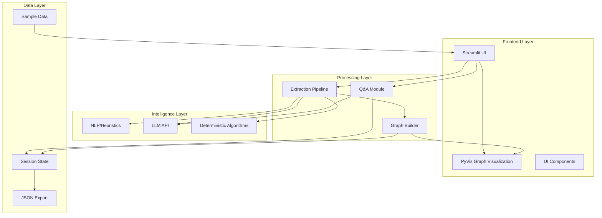
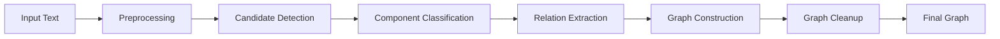
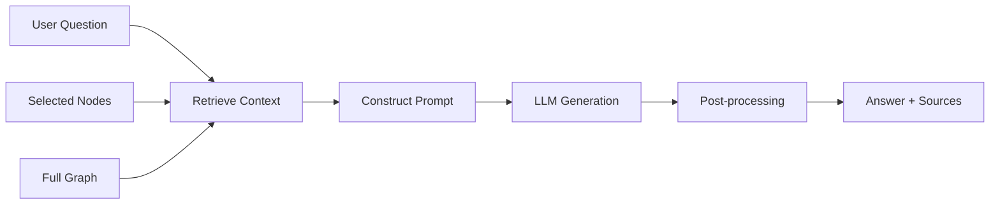

# System Architecture

## Overview

The Argument Graph Builder is a web-based intelligent interactive system that transforms unstructured argumentative text into structured, explorable argument graphs. The architecture follows a pipeline-based approach with clear separation between frontend UI, extraction backend, and Q&A modules.

## High-Level Architecture



## Component Breakdown

### 1. Frontend Layer (Streamlit)

**Purpose:** Provide interactive user interface for text input, graph exploration, and Q&A interaction.

**Key Components:**

- **`app_mockup/app.py`**: Main application orchestrator
  - Manages page state and navigation
  - Handles user input (text paste, file upload, example selection)
  - Coordinates extraction and Q&A requests
  - Renders graph visualization and detail panels

- **`app_mockup/components/vis_network_select.py`**: Custom Streamlit component
  - Wraps vis-network.js for interactive graph rendering
  - Handles node selection via click events
  - Supports graph layout algorithms (hierarchical, force-directed)

**Technologies:**
- Streamlit for rapid prototyping and reactive UI
- PyVis for graph visualization (vis.js wrapper)
- Custom HTML/CSS for styling

**Data Flow:**
1. User inputs text or selects example
2. UI sends text to extraction pipeline
3. Graph data returned and stored in session state
4. Visualization rendered from graph data
5. User interactions (node clicks, Q&A) trigger additional processing

---

### 2. Extraction Pipeline

**Purpose:** Transform raw text into structured argument graph with labeled nodes and relations.

**Current State (Mockup):**
- **`app_mockup/extractor_stub.py`**: Mock implementation
  - Returns pre-generated graphs for sample texts
  - Generates placeholder graphs for custom input
  - Simulates processing delay

**Production Architecture (Planned):**



**Stages:**

1. **Preprocessing**
   - Sentence segmentation
   - Tokenization
   - Coreference resolution

2. **Candidate Detection (Heuristic/NLP)**
   - Identify potential argument components using discourse markers
   - Extract sentences/clauses with argumentative structure
   - Traditional NLP techniques (spaCy, NLTK)

3. **Component Classification (LLM)**
   - Classify each candidate as: Claim, Premise, Objection, Reply, or Other
   - Generate paraphrases for each component
   - Compute confidence scores

4. **Relation Extraction (LLM)**
   - Determine relations between components: Support, Attack, or None
   - Identify relation confidence

5. **Graph Construction (Deterministic)**
   - Build directed graph from nodes and edges
   - Remove duplicates and inconsistencies
   - Compute hierarchical layout

6. **Graph Cleanup (Deterministic)**
   - Validate relation consistency
   - Filter low-confidence nodes/edges (optional)
   - Aggregate confidence scores

**Key Design Decisions:**
- Hybrid approach: fast heuristics for candidate detection, LLMs for nuanced classification
- Deterministic post-processing ensures consistent output regardless of LLM variability
- Confidence scores propagated through pipeline for transparency

---

### 3. Q&A Module

**Purpose:** Answer natural language questions about selected nodes/subgraphs using Retrieval-Augmented Generation.

**Current State (Mockup):**
- **`extractor_stub.py::get_mock_qa_answer()`**: Returns template-based mock answers

**Production Architecture (Planned):**



**Process Flow:**

1. **Context Retrieval**
   - Extract selected nodes and their immediate neighbors
   - Include original text spans and paraphrases
   - Retrieve relation types and metadata

2. **Prompt Construction**
   - Template-based prompt with question, context, and instructions
   - Include guidance for grounding answers in source material
   - Request source attribution

3. **LLM Generation**
   - Send prompt to LLM API (OpenAI, Anthropic, etc.)
   - Parse response for answer and source spans

4. **Post-processing**
   - Validate source spans against original text
   - Compute confidence score
   - Format for UI display

**RAG Strategy:**
- Dense retrieval using node embeddings (future enhancement)
- Currently uses explicit user selection for retrieval
- Transparency through source attribution

---

### 4. Data Layer

**Session State Management:**

Streamlit session state stores:
- `st.session_state.graph_data`: Current graph (nodes, edges, metadata)
- `st.session_state.input_text`: Original input text
- `st.session_state.selected_node`: Currently selected node ID
- `st.session_state.qa_history`: Q&A interaction history
- `st.session_state.edits`: User corrections to nodes

**Graph Schema:**

See [data_formats.md](data_formats.md) for detailed schema documentation.

**Sample Data:**
- Pre-extracted graphs stored in `app_mockup/sample_data/`
- JSON format with nodes, edges, and metadata
- Used for rapid UI development and demos

---

## Non-Functional Requirements

### Performance

**Current (Mockup):**
- Instant graph rendering for pre-generated samples
- 2-second simulated extraction delay

**Target for Course Demo:**
- Extraction: <30 seconds for typical article (1000-3000 words)
- Graph rendering: <1 second for graphs with <100 nodes
- Q&A response: <10 seconds per question

### Reliability (for Demo)

**Error Handling:**
- Graceful degradation: if extraction fails partially, return best-effort graph
- User-visible error messages for API failures
- Fallback to heuristic extraction if LLM unavailable

**Validation:**
- Graph consistency checks (no orphaned nodes, valid edge types)
- Confidence thresholds for filtering unreliable extractions
- User correction mechanisms

---

## Technology Stack

### Current (Mockup)

| Component | Technology | Purpose |
|-----------|-----------|---------|
| Frontend | Streamlit 1.28+ | Rapid prototyping, reactive UI |
| Visualization | PyVis 0.3.2 | Interactive graph rendering |
| Backend | Python 3.9+ | Extraction logic (stubbed) |
| Data Format | JSON | Graph serialization |

### Production (Planned)

| Component | Technology | Purpose |
|-----------|-----------|---------|
| NLP | spaCy / NLTK | Sentence segmentation, NER, coreference |
| LLM API | OpenAI GPT-4 / Anthropic Claude | Classification, paraphrase, Q&A |
| Vector DB | FAISS / ChromaDB | Semantic search (future) |
| Backend | FastAPI (optional) | Async processing, API decoupling |

---

## Deployment Considerations

### For Course Demo

```bash
streamlit run app_mockup/app.py
```

Runs on `localhost:8501` for local development and live demo.

### Deployment Options (Beyond Course Scope)

If hosting the demo online is desired:

**Streamlit Cloud (Simplest)**
- Free tier for public repos
- Secrets management built-in
- No server setup required

**Self-Hosted (More Control)**
- Full control over infrastructure
- Can integrate with custom backend
- Requires server management

---

## Potential Extensions (Beyond Course Scope)

1. **Incremental Extraction**
   - Process text in chunks as user types/uploads
   - Progressive graph updates

2. **Graph Refinement Loop**
   - User feedback incorporated into extraction model
   - Active learning for improved accuracy

3. **Export Integrations**
   - Export to Obsidian, Notion, or other knowledge management tools
   - Argumentation Markup Language (AML) format support

4. **Advanced Analytics**
   - Argument strength metrics
   - Rhetorical analysis
   - Comparative argument visualization

---

## Related Documentation

- [Intelligence Design](intelligence_design.md) — Detailed extraction and Q&A algorithms
- [Data Formats](data_formats.md) — Graph schema and JSON structure
- [Developer Guide](dev_guide.md) — How to modify and extend the system
- [UI Guide](ui_guide.md) — User interaction patterns
